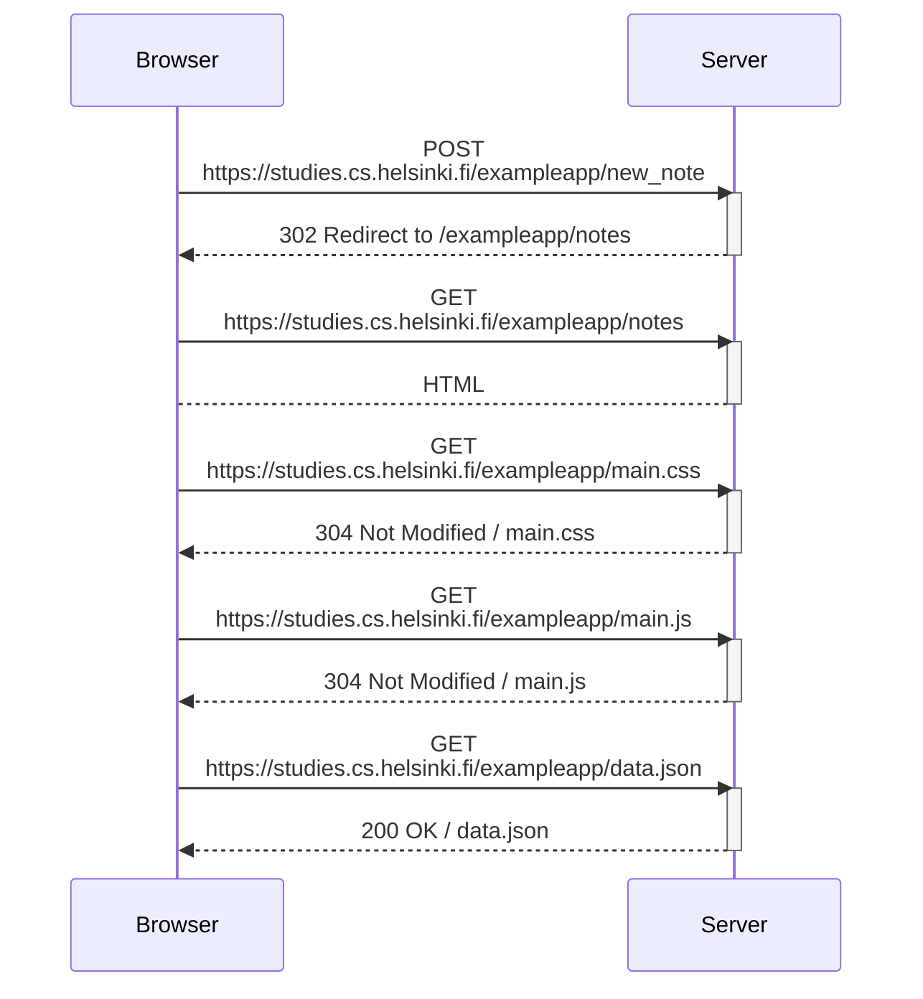

# Creating a new note

This diagram is for documenting how the create a new note works in https://studies.cs.helsinki.fi/exampleapp/notes
 

```mermaid

  sequenceDiagram
  participant Browser
  participant Server

Browser->>Server: POST<br/>https://studies.cs.helsinki.fi/exampleapp/new_note
activate Server
    Server-->>Browser: 302 Redirect to /exampleapp/notes
deactivate Server


Browser->>Server: GET<br/>https://studies.cs.helsinki.fi/exampleapp/notes
activate Server
    Server-->Browser: HTML
deactivate Server

Browser->>Server: GET<br/>https://studies.cs.helsinki.fi/exampleapp/main.css
activate Server
    Server-->>Browser: 304 Not Modified /  main.css
deactivate Server


Browser->>Server: GET<br/>https://studies.cs.helsinki.fi/exampleapp/main.js
activate Server
    Server-->>Browser: 304 Not Modified / main.js
deactivate Server


Browser->>Server: GET<br/>https://studies.cs.helsinki.fi/exampleapp/data.json
activate Server
    Server-->>Browser: 200 OK / data.json
deactivate Server


```
