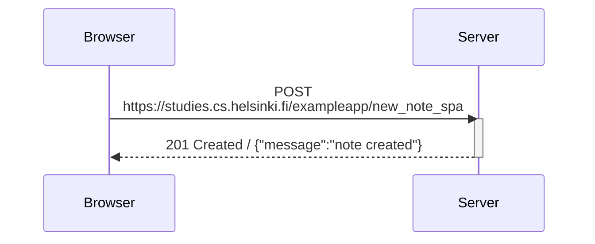

# Creating a new note in Spa

This diagram is for documenting note creation in the Single page application https://studies.cs.helsinki.fi/exampleapp/spa.

```mermaid

  sequenceDiagram
  participant Browser
  participant Server

Browser->>Server:POST<br>https://studies.cs.helsinki.fi/exampleapp/new_note_spa
activate Server
    Server-->>Browser: 201 Created / {"message":"note created"}
deactivate Server


```
