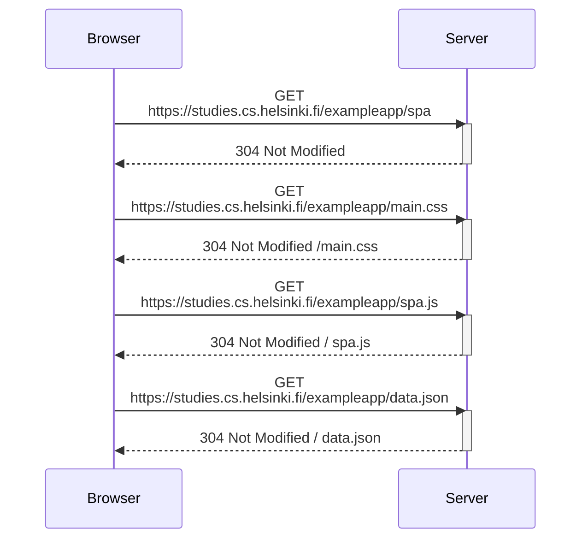

# Starting Spa

This diagram is for documenting a user accesing the Single page application https://studies.cs.helsinki.fi/exampleapp/spa.

```mermaid

  sequenceDiagram
  participant Browser
  participant Server

Browser->>Server:GET<br>https://studies.cs.helsinki.fi/exampleapp/spa
activate Server
    Server-->>Browser: 304 Not Modified
deactivate Server
Browser->>Server: GET<br>https://studies.cs.helsinki.fi/exampleapp/main.css

activate Server
    Server-->>Browser: 304 Not Modified /main.css
deactivate Server

Browser->>Server: GET<br>https://studies.cs.helsinki.fi/exampleapp/spa.js
activate Server
    Server-->>Browser:304 Not Modified / spa.js
deactivate Server

Browser->>Server: GET<br>https://studies.cs.helsinki.fi/exampleapp/data.json
activate Server
    Server-->>Browser:304 Not Modified / data.json
deactivate Server

```
